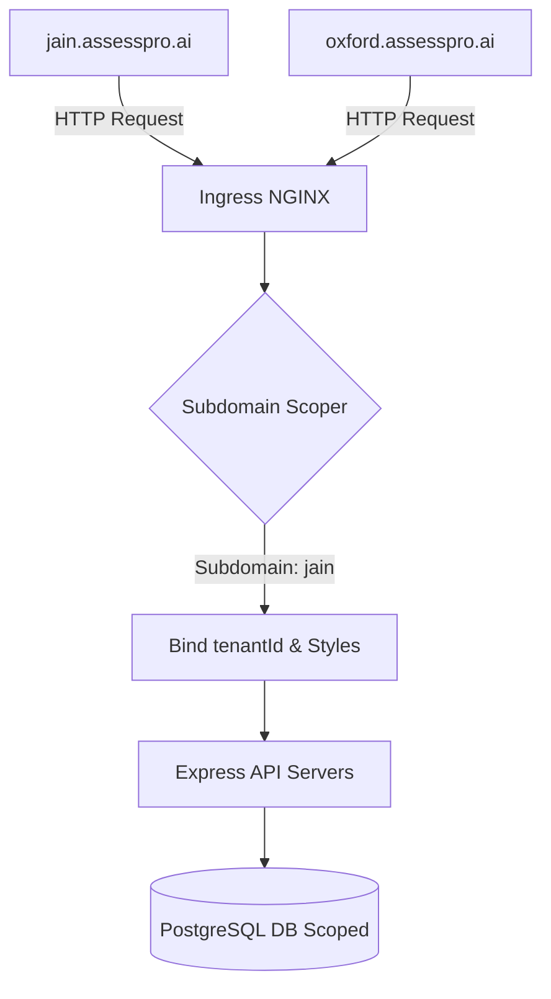
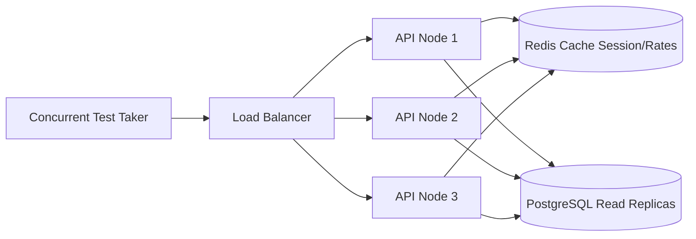

# AssessPro AI - System Architecture

This document describes the multi-tenant SaaS architecture, data model design, scaling strategy, and AI modules for AssessPro AI - Placement Training & Assessment Platform.

---

## 1. Multi-Tenant Strategy

AssessPro AI uses a single-database, multi-tenant scoping model. All tables are logically separated by a `tenantId`.

### Tenant Identification Workflow:
1. **DNS/Ingress**: Requests hit the Nginx Ingress Controller mapped to wildcard domains (`*.assesspro.ai`).
2. **Subdomain Scoping**: The Express API server executes `tenantScoping` middleware on incoming routes:
   - Evaluates `req.headers.host` to extract subdomains (e.g. `jain` from `jain.assesspro.ai`).
   - Looks up colors, styling schemes, and tenant configs in the database.
   - Saves `req.tenantId` and `req.tenantConfig` onto the request object.
3. **Database Scoping**: Database queries are automatically filtered using Prisma Client scoping parameters `where: { tenantId }`.

---

## 2. High-Scalability System Model

The platform is designed to scale horizontally to support 2,000+ concurrent active test takers:

- **Node Clustering**: Employs Node.js clustering inside container pools, spinning up API processes per available CPU core.
- **Caching Layer**: Redis caches active exam sheets, user sessions, and API rate limits.
- **Database Scaling**: Scopes queries via indexed columns (`tenantId` and `email`) with primary-replica replication for assessment reporting workloads.
- **Nginx & CDN**: Assets and frontend bundles are cached on edge networks.

---

## 3. Sandboxed Code Execution Platform

The coding assessment compiler compiles multi-language submissions (Python, Java, JavaScript, C++) inside isolated environments:

- **Verification Metrics**: Tracks runtime execution (CPU milliseconds) and memory footprints (RAM allocation in kilobytes) for each student compilation.
- **Anti-Plagiarism Protection**: Checks code similarity structures against past submissions.
- **Hidden Test Cases**: Evaluates code correctness against primary inputs/outputs stored in the database.

---

## 4. Artificial Intelligence Modules

AssessPro AI embeds Gemini LLM patterns to accelerate placement readiness:

- **AI Resume Scorer**: Calculates compatibility with company job criteria, extracts keywords, and highlights improvements.
- **AI Performance Coach**: Examines aggregate scores to identify weaknesses and generate personalized recommendations.
- **AI Mock Interview Coach**: Uses voice transcripts to score confidence, technical accuracy, and clarity.
- **AI Question Bank**: Dynamically generates aptitude options and programming problem descriptions.
